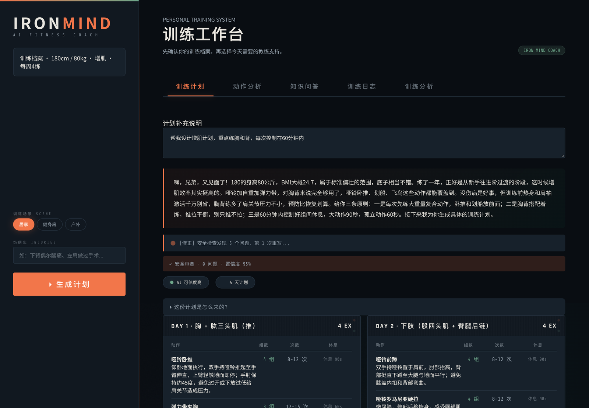
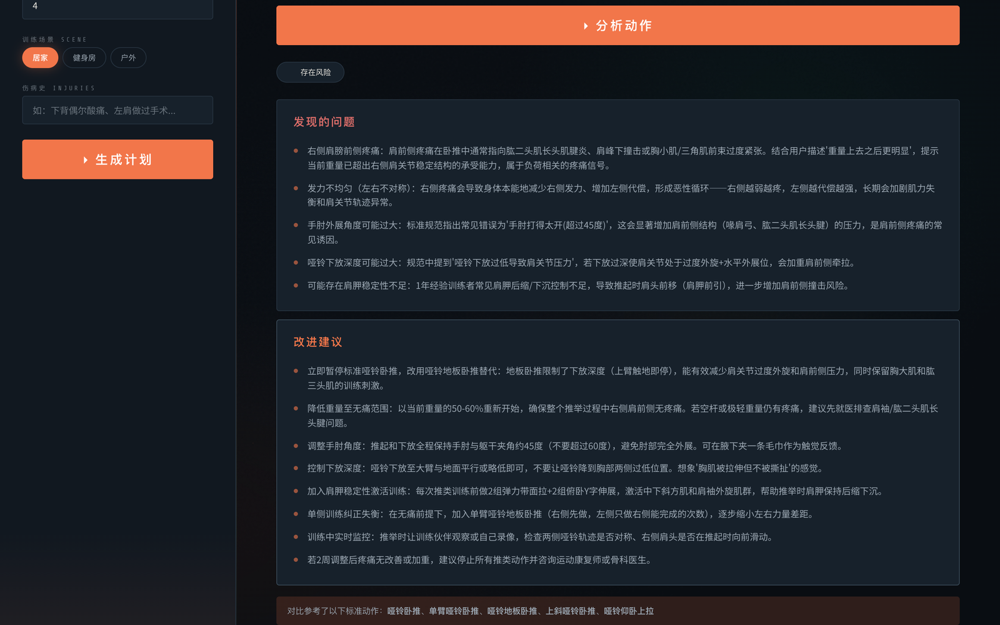
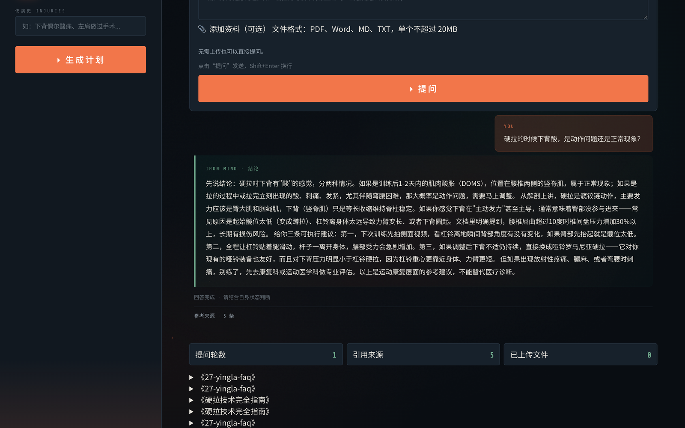

# IRON MIND · AI 健身私教

[](https://github.com/Humble-moon/gakki-ai-fitness/actions/workflows/ci.yml)
[](LICENSE)


Multi-Agent 协作生成个性化训练计划，GraphRAG 做伤病推理，混合检索的知识问答带来源引用。本地运行，浏览器打开就能用。



## 核心功能

### 智能计划生成

输入身高体重、目标与训练场景，AI 先给出针对你现状的分析，再由 Multi-Agent 流水线生成周训练计划。FactChecker 独立做安全审查，发现冲突就触发修正回路——上图那条「安全检查发现 5 个问题，第 1 次重写」就是这条回路在工作。

### 动作分析

输入动作名与训练感受，检索标准动作规范，诊断问题并给出可执行的改进方案。



### 知识问答

自然语言提问，向量检索 + 关键词检索 → RRF 融合 → LLM Re-rank 精排，回答尽量标注依据，涉及伤病时主动提醒。



知识库三种来源（按 `data/knowledge/` 文件系统实测）：

| 来源 | 篇数 | 可追溯性 |
|------|------|---------|
| 手写 | 19（编号 001-018 + 63-HRV） | 逐句可解释；**4 篇伤病安全文档全部在此** |
| PubMed 爬取翻译 | 62（`pubmed_*`） | 每篇带 PMID，同行评审来源 |
| LLM 批量扩展 | 81（编号 019-100，由 `scripts/expand_knowledge.py` 生成） | 主题清单与生成脚本可复现；**`validate_doc()` 仅校验结构（字数/标题/核心要点/列表），不校验内容安全或事实准确性** |

安全关键内容不走生成路径，且安全判定不依赖知识库——FactChecker 的规则引擎是独立的伤病冲突表（47 关键词 → 200 禁止对）+ 15 份语义档案，删掉整个知识库它仍能拦截高危组合。块数 **557 chunks** 取自 2026-08-30 摄入输出、与评测 manifest 同源，但静态清单无法核验（数据在 PostgreSQL，需重跑摄入才能复测）。

## 架构

```
用户 → FastAPI (SSE 流式)
         │
    LangGraph 状态图编排 (src/graph)
         │
    ┌────┼────┬──────────┐
    ▼    ▼     ▼          ▼
 Planner  Retriever  Writer  FactChecker
(任务拆解) (多源检索) (计划生成) (安全审查+HITL)
    │    │  │
    │    │  └── GraphRAG (Neo4j 知识图谱 338 动作节点多跳推理)
    │    └───── Agentic RAG (自评 + 改写 + 3 轮迭代)
    └────────── Skill 系统 (v3 插件化目录 + Planner v4 安全闸门)
         │
    ┌────┼────┬──────────┐
    ▼    ▼     ▼          ▼
 PostgreSQL  Neo4j   Redis   MinIO
 (pgvector)         (缓存+记忆)
```

## 技术栈

| 层级 | 技术 |
|------|------|
| Agent 编排 | LangGraph 状态图（主路径，含 checkpointer + HITL `interrupt()`）；命令式 Orchestrator 作为对照与降级保留，两套共享 `plan_finalization.py` 终态逻辑 |
| 协议 | FastMCP 完整协议实现（Tools + Resources + JSON-RPC 错误码） |
| 模型 | deepseek-chat + deepseek-reasoner 双模型架构 + 熔断器 |
| RAG | 向量检索（HNSW）+ 关键词检索 → RRF 融合 → LLM Re-rank |
| 知识图谱 | Neo4j + Cypher（动作→肌肉→器械→伤病 四类实体） |
| 向量化 | DashScope text-embedding-v4（1024 维，API 调用） |
| 缓存 | Redis 语义缓存（二级命中：精确 + 余弦相似度扫描） |
| 安全 | FactChecker 双重校验 + HITL（关键词 + embedding 语义双路） |
| 记忆 | 短期滑动窗口 + 长期记忆（带时间戳） |
| 评测 | 206 条 Golden Dataset + 三组消融实验 + E2E/RAGAS + Serving 压测 |
| 前端 | FastAPI + SSE + 暗黑工业风 HTML/CSS/JS |
| 部署 | Docker Compose（PostgreSQL + Neo4j + Redis + MinIO） |

## 快速开始

```bash
# 1. 安装依赖（不加载本地向量模型，装的是 API 版依赖）
pip install -r requirements.txt

# 1b. 可选：跑 RAGAS 评测才需要
# pip install -r requirements-eval.txt

# 2. 配置环境变量
cp .env.example .env
# 编辑 .env，填入 DeepSeek API Key 和 DashScope API Key

# 3. 启动基础服务（PostgreSQL/Neo4j/Redis/MinIO）
docker compose up -d

# 4. 灌入种子数据（338 个动作 → PG + Neo4j）
python -m src.main --seed

# 5. 摄入知识库（162 篇文档；chunk 数量以实际摄入输出为准 → pgvector）
python -m src.rag.knowledge_ingestion --dir data/knowledge

# 6. 启动服务
python app/server.py
# → 浏览器打开 http://localhost:8503
```

## 执行脚手架（Harness）

模型之外的那层执行设施。它不是一个新模块，而是把原本散落在各处的执行能力登记到一起，让「脚手架」成为一个可讨论、可评测、可替换的层。

| 能力 | 承载模块 |
|------|---------|
| 编排与状态 | `src/graph/`（LangGraph 状态图 + checkpointer） |
| Agent 自主循环 | `src/harness/loop.py` |
| 工具注册 | `src/mcp/tool_registry.py` |
| 上下文管理 | `src/memory/conversation.py`（滑窗 + 异步摘要） |
| 人工闸门 | `src/hitl/` |
| 输出约束 | `src/core/goal_contract.py`、`src/agents/output_validation.py` |
| 失败恢复 | `src/llm/provider.py`（重试）、`src/harness/resilience.py`（墙钟超时） |
| 预算配置 | `src/harness/config.py`（唯一事实源） |

`src/harness/config.py` 集中所有执行预算（重试次数、重写轮次、循环步数、token 上限）。`tests/test_harness_contract.py` 会断言这些取值与各消费模块实际使用的常量一致，任何一处改了而另一处没跟上都会让测试失败。

**Agent 自主循环**（`src/harness/loop.py`）是 ReAct 式的可选路径：让模型自己决定调哪个工具、调几次。默认**关闭**——现有确定性流水线对训练计划生成这类任务是更合适的选择（路径可预测、可评测、延迟低）。自主循环面向知识问答这类步骤数事先未知的开放式任务。

```bash
# 启用自主循环（实验性）
HARNESS_AGENT_LOOP=1 python app/server.py
```

循环的三个要点：预算硬上限（`max_steps` + `token_budget`，没有刹车的 agent loop 等于失控的账单）；工具报错回喂模型而非中断流程，让它自己换策略；每步可挂 checkpoint 回调以支持续跑。

### 知识问答的两条路径

`Orchestrator.answer_question_stream` 是统一入口，按开关分发：

| | 固定流水线（默认） | 自主循环（`HARNESS_AGENT_LOOP=1`） |
|---|---|---|
| 检索 | 每次必查知识库 + 动作库，伤病题再查图谱 | 由模型决定查什么、查几次 |
| 延迟 | 可预测 | 波动 |
| 代码 | `_answer_question_fixed_stream` | `src/core/qa_agent.py` + `src/harness/qa_tools.py` |

**自主循环失败会自动回退到固定流水线**（预算触顶或调用异常时），并在事件流里明确告知用户——把一次提问赌在实验路径上是不负责任的。

两条路径**共用同一份安全实现**（`src/core/qa_safety.py`）：伤病相关的安全检测与硬约束若各存一份，迟早会漂移，而用户看不出自己走的是哪条路。`tests/test_qa_dispatch.py` 会断言这个共用关系。

```bash
# 对比两条路径的过程开销
python -m eval.compare_qa_paths --limit 5 --output eval/qa_path_compare.json
```

自主循环路径通过提示词协议（`src/harness/tool_calling.py`）驱动模型返回结构化 JSON，因为 `src/llm/provider.py` 尚不支持原生 function calling；解析失败会降级为「当作最终答案」并告警，宁可提前结束也不在解析错误上空转到预算耗尽。**该路径尚未在真实模型上端到端跑过**，其正确性由离线假模型测试保证（`tests/test_qa_agent.py`），不等同于真实链路的成功率。过程指标见 `eval/metrics/harness_metrics.py`（成功率、预算触顶率、工具调用有效率、错误恢复率、checkpoint 续跑正确性）。

## 评测与验证

```bash
make facts   # 只读统计动作、知识文档、评测样本与测试文件
make eval    # 评测
make test    # 默认测试
make e2e     # 离线/核心 E2E 检查
```

默认 `pytest` 通过 `pytest.ini` 排除 `integration/live`；这两类测试必须显式 opt-in，不代表默认离线测试覆盖真实外部服务。`make e2e` 仅运行当前仓库可用的离线/核心 E2E 检查，缺少真实依赖时必须明确失败或跳过，不伪造成功。评测数据集、历史状态、可比性和限制见 [评测索引](eval/README.md)。

演示与离线验证入口（不泄露密钥，也不需要真实 key）：

```bash
# 不需要真实 key；启动本地服务（业务依赖仍按现有配置工作）
python scripts/run_demo.py --mode demo --host 127.0.0.1 --port 8503

# 仅检查 full 配置，不安装或自动启动 PostgreSQL/Neo4j/Redis/MinIO
python scripts/run_demo.py --mode full --check

# 检查 demo 配置，不输出 .env 或任何 key
python scripts/run_demo.py --check

# 三条业务 SSE 离线验证；必须收到显式 done/error/cancelled terminal 事件
python scripts/run_e2e.py --json
```

`full` 模式只检查配置并要求 provider 已配置，不处理密钥，也不自动安装或启动外部服务。SSE 流在没有明确 terminal 事件时视为失败，EOF 不代表成功。当前项目未声明或安装 Playwright，因此不覆盖浏览器 E2E；现有前端契约测试仍属于静态/接口级验证。

```bash
python scripts/verify_project_facts.py --json
```

该命令只读统计当前仓库的动作、知识文档、评测样本和测试文件；输出中的 `warnings` 会报告 README 当前声称的块数并说明它为何无法被静态核验（块数据在 PostgreSQL，不在磁盘 JSON 里）。

## 项目结构

```
├── app/                          # FastAPI 后端 + 前端
│   ├── server.py                 # API 入口（SSE 流式）
│   └── static/index.html         # IRONMIND 暗黑工业风 UI
├── src/
│   ├── agents/                   # 四 Agent（Planner/Retriever/Writer/FactChecker）
│   ├── harness/                  # 执行脚手架（预算配置/自主循环/超时）
│   │   ├── config.py             # 执行预算的唯一事实源
│   │   ├── loop.py               # ReAct 自主循环（可选路径）
│   │   ├── qa_tools.py           # 问答工具门面（知识库/动作库/图谱）
│   │   ├── tool_calling.py       # 提示词工具调用适配器
│   │   └── resilience.py         # 墙钟超时
│   ├── core/                     # Orchestrator 编排引擎
│   │   ├── qa_agent.py           # 问答自主循环路径（可选）
│   │   └── qa_safety.py          # 问答安全检测与硬约束（两条路径共用）
│   ├── mcp/                      # FastMCP 完整协议实现
│   │   ├── exercise_server.py    # MCP 工具（接 PG 数据库）
│   │   └── tool_registry.py      # 工具注册门面
│   ├── rag/                      # RAG 五层检索体系
│   │   ├── agentic_rag.py        # 自评改写迭代检索
│   │   ├── knowledge_search.py   # RRF 融合 + LLM Re-rank
│   │   └── semantic_cache.py     # Redis 语义缓存（二级命中）
│   ├── graphrag/                 # Neo4j 知识图谱检索
│   ├── llm/                      # LLMProvider 多模型管理 + 熔断器
│   │   └── provider.py           # chat + chat_stream + JSON mode
│   ├── memory/                   # 多轮对话 + 长期记忆（带时间戳）
│   ├── storage/                  # PG/Neo4j/Redis/MinIO 客户端
│   ├── skills/                   # Skill 系统（SkillLoader 自动发现）
│   ├── a2a/                      # A2A 消息总线（Task/Artifact）
│   ├── hitl/                     # HITL 人在回路（关键词 + embedding 语义）
│   └── models/                   # Pydantic 数据模型
├── skills/                       # Skill 插件目录（SKILL.md + references + scripts）
│   ├── muscle_building/
│   ├── fat_loss/
│   └── exercise_analysis/
├── tests/                        # 测试用例（数量以 pytest 实际收集为准）
├── scripts/                      # 数据工具
│   ├── fetch_knowledge.py        # PubMed 爬取
│   ├── translate_knowledge.py    # LLM 翻译改写
│   ├── expand_exercises.py       # LLM 扩展动作库
│   ├── expand_knowledge.py       # LLM 扩展知识库
│   └── create_hnsw_indexes.sql   # HNSW 索引迁移
├── eval/                         # 评测框架（206 条 Golden Dataset + 消融/E2E/RAGAS/压测）
├── docs/screenshots/             # 界面截图（README 用）
├── data/knowledge/               # 健身知识库（162 篇文档；chunk 数量以实际摄入输出为准）
├── run_mcp_server.py             # MCP 独立服务器（stdio/SSE/HTTP）
├── docker-compose.yml
├── requirements.txt              # 运行时依赖（API 版向量化，不含 torch）
└── requirements-eval.txt         # 可选：RAGAS 评测依赖
```

## 扩展知识库（可选）

```bash
# 从 PubMed 爬取运动科学文献
python scripts/fetch_knowledge.py

# 翻译改写为中文健身科普文章
python scripts/translate_knowledge.py

# LLM 批量扩展动作库 / 知识库
python scripts/expand_exercises.py
python scripts/expand_knowledge.py

# 增量摄入（只处理变更文件）
python -m src.rag.knowledge_ingestion --dir data/knowledge --incremental
```

## 边界与说明

当前版本定位为 **localhost 单用户演示**，不承诺公网多用户、完整人工审核闭环或生产服务等级。可复核数字、证据路径、未核验口径与推荐边界话术，见 [项目事实基线](docs/project-fact-baseline.md)。

项目自 **2026-04** 起在本地开发，**2026-07-01 初始化 Git 仓库**并开始产生提交历史，因此 `git log` 的最早提交晚于实际开工时间。详见 [项目事实基线](docs/project-fact-baseline.md) 的「未核验与历史结果」一节（该段为开发者陈述，仓库无法独立复核）。

---

作者：gakki
